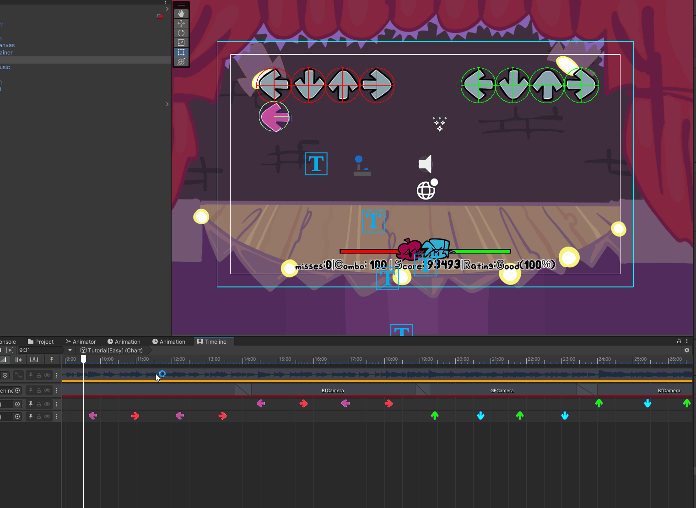
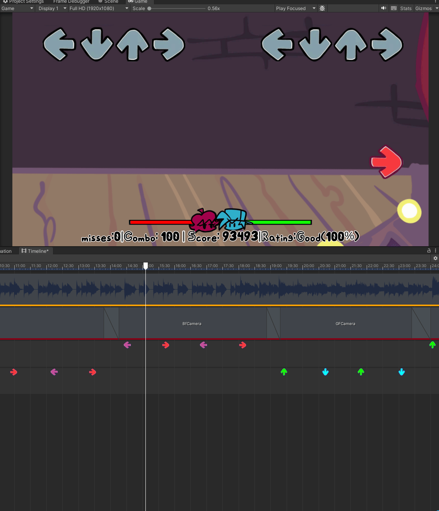

# **Friday Night Funkin UnityAsset**
 <h3>This asset was created so that anyone can make their own Friday night funkin on unity, for free.</h3>
# Dependencies
## You can download all Dependencies in Unity Package Manager
### Universal Renderer Pipline (URP)
### Timeline
### Input System
### Cinemachine

# Download Pakage
## You can download package and just open it in unity, but you will need to download all Dependencies
### [**Google Disk**](https://drive.google.com/file/d/15jRPxyGE1gxGu_fFBvNtzltO6EAVcLxr/view?usp=sharing)
## also u can download all unity project from git

# Features
## 1. Editor
+ <h3> The chart editor is based on the unity timeline, allowing you to modify the chart directly from the editor</h3>

        

+  <h3> You can add arrows using the contex menu and freely change their position in the temporary lines and delete them.</h3>

        

+ <h3> You can also use hotkeys to copy and paste arrows into the timeline</h3>

        

## 2. Game
+ <h3>Fully replicated gameplay with a working player and bot</h3>
        

## 3. Interface and menus
+ <h3>ready-made interface and various menus from the original game</h3>
        
